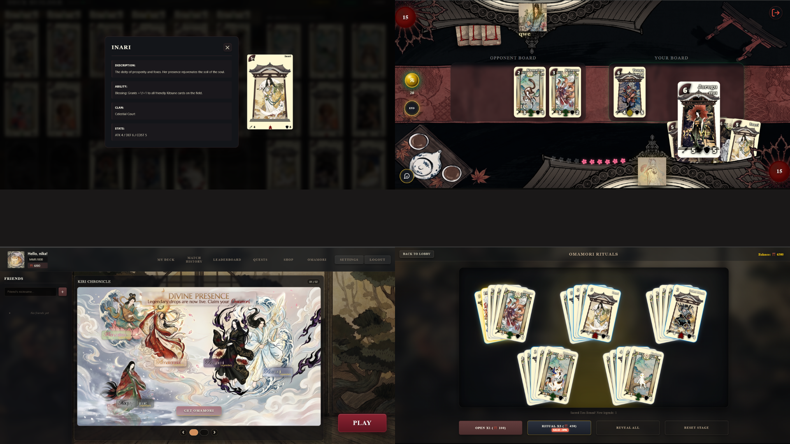

<div align="center">



<br><br>

# ⋆ ˚｡⋆ [ k i r i ] ⋆｡˚ ⋆

*japanese-themed multiplayer web card game* `real-time pvp` ⋆ `gacha mechanics` ⋆ `custom deck building`

<br>

### 🪷 ａｂｏｕｔ ｐｒｏｊｅｃｔ
kiri is a multiplayer online card game featuring a real-time battle system, 
social features, and a rich japanese mythology aesthetic. players can collect 
cards via gacha (omamori), build custom decks, and fight in real-time pvp matches.

<br>

### 👥 ｔｅａｍ ＆ ｒｏｌｅｓ

**[ nntrwx ]** ⋆ *Project Lead, UI/UX Designer & Front-End*
* **UI & Front-end:** Designed and implemented the core visual experience, including the dynamic battlefield, deck builder, lobby, settings, friendlist, gacha (omamori) system, and event banners.
* **Game Design & Management:** Designed the complete card roster (stats, abilities, lore) and managed task distribution for the entire team.

**[ Dornsen ]** ⋆ *Back-End Developer & TechLead*
* Completely responsible for the server architecture, real-time game logic (WebSockets), and database design (MySQL).

**[ shrimp228 ]** ⋆ *Illustrator & Front-End*
* Illustrated custom in-game emotes/stickers, prototyped card avatars, and implemented UI windows for the leaderboard, marketplace, quests, and match history.

<br>

### 💿 ｔｅｃｈ ｓｔａｃｋ


<br><br>
</div>

---

# 🎮 Card Battle Game

A multiplayer online card game with real-time battle system, social features, and marketplace.

## 🚀 Quick Start

### Requirements
- Node.js >= 14
- MySQL >= 5.7

### Installation & Setup

1. **Install dependencies:**
```bash
cd server
npm install
```

2. **Create `.env` file in the `server/` folder**

Create a file named `.env` in the `server` directory with the following content:

```env
# Database Configuration
DB_HOST=localhost
DB_USER=root
DB_PASSWORD=your_password
DB_NAME=KIRIdatabase

# Server Configuration
PORT=3000

# Mail Configuration (optional)
MAIL_USER=your_email@gmail.com
MAIL_PASS=your_app_password

```

3. **Start the server:**

**Development mode** (with auto-restart):
```bash
npm run dev
```

**Production mode:**
```bash
npm start
```

4. **Open in your browser:**
```
http://localhost:3000
```

## 📝 .env Variables Explained

| Variable | Description | Example |
|---|---|---|
| `DB_HOST` | MySQL server address | `localhost` |
| `DB_USER` | MySQL username | `root` |
| `DB_PASSWORD` | MySQL password | `password123` |
| `DB_NAME` | Database name | `KIRIdatabase` |
| `PORT` | Server port | `3000` |
| `NODE_ENV` | Environment mode | `development` or `production` |
| `MAIL_SERVICE` | Email service provider | `gmail` |
| `MAIL_USER` | Email address for sending mails | `your_email@gmail.com` |
| `MAIL_PASS` | Email app password | `xxxx xxxx xxxx xxxx` |
| `GAME_SECRET` | Secret key for game sessions | `any_random_string` |

## 📁 Project Structure

```
.
├── client/              # Frontend application
├── server/              # Backend application
│   ├── .env             # Environment variables (CREATE THIS FILE)
│   ├── server.js        # Main server file
│   ├── package.json     # Dependencies
│   ├── config/          # Configuration files
│   ├── controllers/     # Business logic
│   ├── game/            # Game logic
│   ├── migrations/      # Database migrations
│   └── sockets/         # WebSocket handlers
└── database/            # Database
    └── init.sql         # Database schema
```

## 🎯 Features

- Real-time PvP battles via WebSockets
- Deck building system
- Daily quests and rewards
- Marketplace with cards and emotes
- Leaderboard and rankings
- Match history
- Friends system
- News feed
